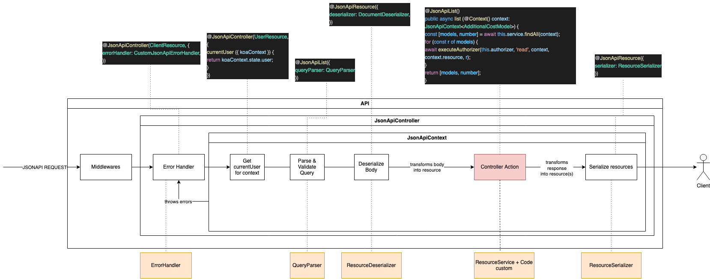

# Introduction

The `@triptyk/nfw-jsonapi` contains a builder that setups jsonapi endpoints and resources.

## Installation

!!! info     
    This module depends of : `@triptyk/nfw-core`, `@triptyk/nfw-http`, `@triptyk/nfw-mikro-orm`.

```sh
pnpm install @triptyk/nfw-jsonapi
```

!!! danger
    This module is experimental and subject to drastical changes

## What it does

The final goal of this addon is to:

- [ ] Be agnostic of the database.
- [x] Make it easier to parse and validate request body/query to a convenient format.
- [x] Easier routing and creation of jsonapi routes for a given resource.
- [x] Easily describe the behavior, relationships and attributes of a resource.
- [ ] Support of JSONAPI version 1.0.

### Schema


